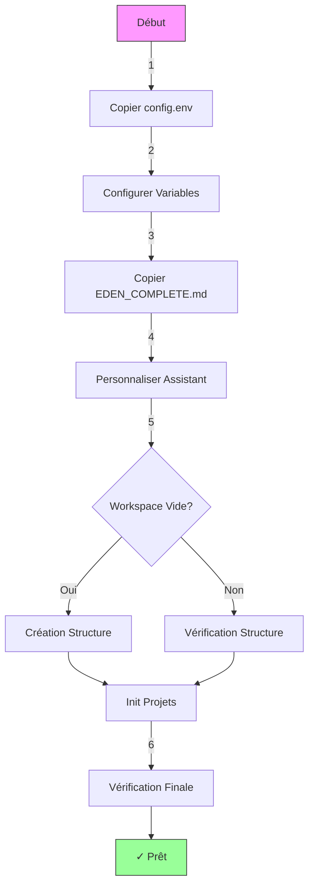
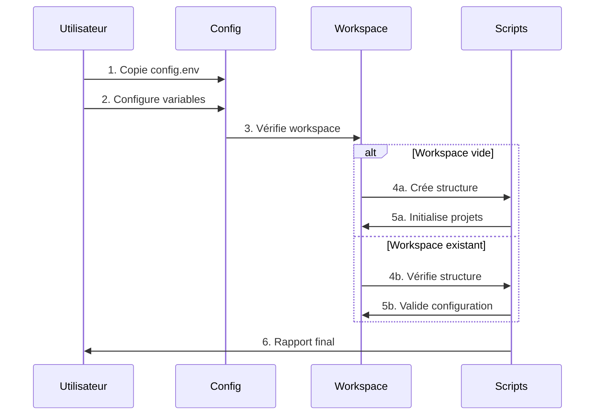
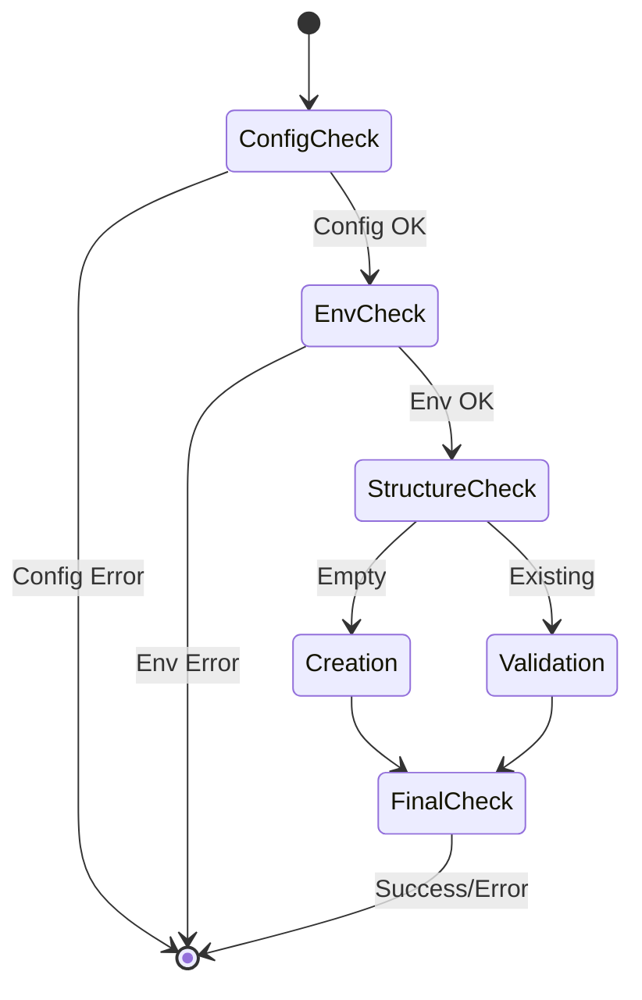
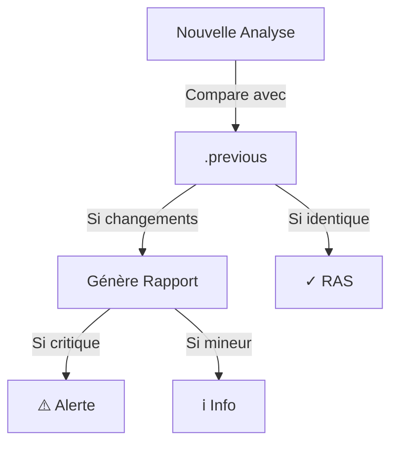

# 🚀 Cursor Template

## 📋 Table des Matières
1. [Pourquoi Cursor Template ?](#-pourquoi-cursor-template)
   - [État actuel de Cursor IDE](#état-actuel-de-cursor-ide)
   - [Ce que Cursor Template apporte](#ce-que-cursor-template-apporte)
   - [Le défi](#le-défi)
   - [La solution](#la-solution)
   - [Les bénéfices](#les-bénéfices)
2. [Technologies Actuellement Supportées](#-technologies-actuellement-supportées)
   - [Frontend (Next.js)](#frontend-nextjs)
   - [Backend (Python/FastAPI)](#backend-pythonfastapi)
   - [Infrastructure](#infrastructure)
3. [Installation](#-installation)
   - [Processus Complet](#processus-complet)
   - [Configuration Initiale](#️-configuration-initiale)
   - [Processus d'Initialisation](#-processus-dinitialisation)
   - [Structure Générée](#-structure-générée)
   - [Vérifications Automatiques](#-vérifications-automatiques)
   - [Résultat Final](#-résultat-final)
   - [Solutions Alternatives](#-solutions-alternatives)
4. [Configuration](#️-configuration)
   - [config.env](#configenv)
   - [EDEN_COMPLETE.md](#eden_completemd)
   - [.cursorrules](#cursorrules)
5. [Personnalisation Avancée](#️-personnalisation-avancée)
   - [Modifier la Structure du Workspace](#modifier-la-structure-du-workspace)
   - [Ajouter de Nouvelles Technologies](#ajouter-de-nouvelles-technologies)
6. [Utilisation](#-utilisation)
   - [Premier lancement](#premier-lancement)
   - [Vérification de l'environnement](#vérification-de-lenvironnement)
7. [Maintenance](#-maintenance)
   - [Vérification quotidienne](#vérification-quotidienne)
   - [Rotation des fichiers d'analyse](#rotation-des-fichiers-danalyse)
8. [Bonjour ! Je prends la parole pour...](#-bonjour--je-prends-la-parole-pour-)
   - [Mon Petit Rituel d'Initialisation](#-mon-petit-rituel-dinitialisation)
   - [Mon Rapport de Situation](#-mon-rapport-de-situation)
   - [Mes Petites Manies](#️-mes-petites-manies)
   - [Mon Objectif](#-mon-objectif)
   - [Comment Travailler Avec Moi](#-comment-travailler-avec-moi)

## ⭐ Pourquoi Cursor Template ?

### État actuel de Cursor IDE

Cursor propose nativement :
- **Gestion basique des workspaces**
  * Ouverture de dossiers
  * Navigation entre fichiers
  * Recherche simple
- **Configuration de l'IA**
  * Fichier `.cursorrules` (ajout récent)
  * URLs de documentation dans les préférences
  * Paramètres basiques dans les settings

Mais il manque des fonctionnalités essentielles :
- ❌ Pas de vraie compréhension de la structure multi-projets
- ❌ Pas de gestion de configuration centralisée
- ❌ Pas de système de validation d'environnement
- ❌ Pas de détection automatique des changements
- ❌ Pas de standardisation des réponses de l'IA
- ❌ Pas de gestion des versions entre projets
- ❌ Pas de système de templates pour les prompts
- ❌ Pas de personnalisation poussée de l'assistant

### Ce que Cursor Template apporte

1. **Gestion du contexte multi-projets**
   - Vue workspace intégrée
   - Système de configuration centralisé
   - Compréhension des relations entre projets

   ```mermaid
   graph TD
      A[cursor-template] -->|Configure| B[config.env]
      B -->|Définit| C[Structure Workspace]
      B -->|Versions| D[Outils]
      B -->|Variables| E[Environnement]
      
      C -->|Frontend| F[Next.js]
      C -->|Backend| G[Python]
      C -->|Core| H[Services]
      C -->|Doc| I[Documentation]
      
      F -->|Dépend de| G
      G -->|Utilise| H
      H -->|Décrit dans| I
   ```

   ```
   📁 Workspace
   ├── 🔧 cursor-template/    # Configuration centrale
   │   ├── 📄 config.env     # Source unique de vérité
   │   └── 🤖 .cursorrules   # Comportement de l'IA
   │
   ├── 🎨 Frontend/          # Interface utilisateur
   │   └── 📱 Next.js
   │
   ├── ⚙️ Backend/           # API et services
   │   └── 🐍 Python
   │
   ├── 🛠️ Core/             # Services centraux
   │   └── 🔄 Modules
   │
   └── 📚 Documentation/     # Documentation globale
       └── 📖 Guides
   ```

2. **Standardisation des interactions**
   - Templates de prompts prédéfinis
   - Règles de comportement configurables
   - Format de réponse personnalisable

   ```mermaid
   sequenceDiagram
      participant U as Utilisateur
      participant C as Cursor
      participant T as Template
      participant A as Assistant

      U->>C: Question/Demande
      C->>T: Vérifie les règles
      T->>A: Applique le template
      A->>T: Génère réponse
      T->>C: Formate réponse
      C->>U: Réponse standardisée
   ```

   ```
   📝 Format de Réponse
   ├── 🎯 Objectif
   │   └── "Je vais [action] pour [but]"
   │
   ├── 🔍 Analyse
   │   ├── État actuel
   │   └── Points d'attention
   │
   ├── 🛠️ Actions
   │   ├── Étapes précises
   │   └── Commandes exactes
   │
   └── ✅ Vérification
       ├── Tests effectués
       └── Résultats obtenus
   ```

3. **Automatisation des vérifications**
   - Check-up automatique de l'environnement
   - Détection des changements de structure
   - Validation des versions et dépendances

   ```mermaid
   graph LR
      A[Lancement] --> B{Config OK?}
      B -->|Non| C[Init Config]
      B -->|Oui| D{Env OK?}
      
      D -->|Non| E[Fix Env]
      D -->|Oui| F{Structure OK?}
      
      F -->|Non| G[Fix Structure]
      F -->|Oui| H[✓ Prêt]
      
      C --> D
      E --> F
      G --> H
   ```

   ```
   🔄 Cycle de Vérification
   ├── 📊 Ressources
   │   ├── RAM: ${MIN_MEMORY_GB}GB min
   │   ├── CPU: ${MIN_CPU_CORES} cores
   │   └── Disk: ${MIN_DISK_SPACE}
   │
   ├── 🛠️ Outils
   │   ├── Python: ${PYTHON_VERSION}
   │   ├── Node: ${NODE_VERSION}
   │   └── Git: ${GIT_VERSION}
   │
   └── 📁 Structure
       ├── Permissions ✓
       ├── Virtualenvs ✓
       └── Dependencies ✓
   ```

   ```mermaid
   stateDiagram-v2
      [*] --> Checking
      Checking --> OK
      Checking --> Warning
      Checking --> Error
      
      OK --> [*]
      Warning --> UserAction
      Error --> AdminAction
      
      UserAction --> Checking
      AdminAction --> Checking
   ```

4. **Gestion de la documentation**
   - Système centralisé pour les URLs de doc
   - Meilleure intégration des docs dans les réponses
   - Règles de documentation automatiques

   ```mermaid
   graph TD
      A[Documentation] --> B[Centralisée]
      A --> C[Contextuelle]
      A --> D[Automatique]
      
      B --> E[URLs]
      B --> F[Versions]
      B --> G[Standards]
      
      C --> H[Dans le code]
      C --> I[Dans les réponses]
      C --> J[Dans les erreurs]
      
      D --> K[Génération]
      D --> L[Mise à jour]
      D --> M[Validation]
   ```

   ```
   📚 Structure Documentation
   ├── 📖 Guides
   │   ├── 🚀 Getting Started
   │   ├── 💡 Best Practices
   │   └── 🔧 Troubleshooting
   │
   ├── 🔗 Références
   │   ├── 📋 API
   │   ├── 🛠️ CLI
   │   └── ⚙️ Config
   │
   └── 📝 Templates
       ├── 📄 README
       ├── 🐛 Issues
       └── 📦 Releases
   ```

   ```mermaid
   sequenceDiagram
      participant D as Doc
      participant C as Code
      participant T as Tests
      
      D->>C: Définit standards
      C->>T: Vérifie conformité
      T->>D: Met à jour
      
      Note over D,T: Cycle continu
   ```

5. **Personnalisation de l'assistant**
   - Configuration du "caractère" de l'IA
   - Adaptation du niveau de détail des réponses
   - Personnalisation des formats de sortie

   ```mermaid
   mindmap
      root((Assistant))
        Personnalité
            Professionnel
            Pédagogique
            Proactif
        Niveau de détail
            Concis
            Standard
            Détaillé
            Expert
        Format
            Texte
            Schémas
            Code
            Logs
   ```

   ```
   🤖 Configuration Assistant
   ├── 🎭 Personnalité
   │   ├── Style: Professionnel
   │   ├── Ton: Informel
   │   └── Approche: Proactive
   │
   ├── 📊 Niveau de détail
   │   ├── DEFAULT: Standard
   │   ├── QUICK: Concis
   │   └── EXPERT: Détaillé
   │
   └── 🎨 Format de sortie
       ├── 📝 Documentation
       ├── 💻 Code
       └── 📊 Schémas
   ```

   ```mermaid
   stateDiagram-v2
      [*] --> Analyse
      Analyse --> DétectionContexte
      DétectionContexte --> AdaptationStyle
      AdaptationStyle --> GénérationRéponse
      GénérationRéponse --> Formatage
      Formatage --> [*]

      note right of DétectionContexte
        Adapte le comportement selon:
        * Type de demande
        * Niveau technique
        * Urgence
      end note
   ```

### Le défi
Le développement avec une IA pose plusieurs défis :
- Navigation complexe entre plusieurs projets interconnectés
- Confusion de l'IA sur les chemins et la structure
- Incohérence dans les réponses selon le contexte
- Répétition des mêmes instructions à chaque conversation
- Manque de standardisation dans les interactions

### La solution
Cursor Template est un framework de configuration et d'automatisation conçu pour :
- **Comprendre** la structure complète du workspace
- **Naviguer** intelligemment entre les projets
- **Maintenir** le contexte entre les conversations
- **Standardiser** les interactions et réponses
- **Automatiser** les vérifications et corrections

### Les bénéfices
1. **Gestion centralisée**
   - Configuration unifiée via `config.env`
   - Standardisation des versions des outils
   - Gestion automatisée des environnements virtuels
   - Détection et suivi des changements workspace

2. **Automatisation**
   - Scripts d'initialisation automatique
   - Vérification de l'environnement
   - Validation de la structure du workspace
   - Gestion des dates et timestamps

3. **Validation et Contrôle**
   - Vérification des ressources système
   - Contrôle des versions des outils
   - Validation des dépendances
   - Détection des incohérences

## 🎯 Technologies Actuellement Supportées

### Frontend (Next.js)
- Framework : Next.js ${NEXT_VERSION}
- UI : shadcn/ui ${SHADCN_VERSION}
- Styling : Tailwind CSS ${TAILWIND_VERSION}
- State : Zustand ${ZUSTAND_VERSION}
- Auth : Clerk ${CLERK_VERSION}
- Email : React Email ${REACT_EMAIL_VERSION}
- Tests : Vitest ${VITEST_VERSION}, Playwright ${PLAYWRIGHT_VERSION}

### Backend (Python/FastAPI)
- Runtime : Python ${PYTHON_VERSION}
- RAG : LangChain ${LANGCHAIN_VERSION}
- Vector DB : Qdrant ${QDRANT_VERSION}
- Database : Supabase ${SUPABASE_VERSION}
- ORM : Drizzle ${DRIZZLE_VERSION}
- Cache : Redis ${REDIS_VERSION}
- Tests : Pytest ${PYTEST_VERSION}

### Infrastructure
- Docker ${DOCKER_VERSION}
- Docker Compose ${DOCKER_COMPOSE_VERSION}
- Package Manager : pnpm ${PNPM_VERSION}
- Support : Coolify, Cloudflare, OVH

## 🔧 Installation

### Processus Complet


### ⚠️ Configuration Initiale

⚠️ **Important** : Ces étapes doivent être effectuées AVANT toute interaction avec l'IA :

1. **Configuration Technique** :
   ```bash
   # Copier config.env.example vers config.env
   cp config.env.example config.env
   # Éditer config.env avec vos paramètres
   ```
   ```
   📄 config.env.example (à copier vers config.env)
   ├── 🌍 Workspace
   │   ├── WORKSPACE_ROOT="/chemin/workspace"
   │   └── WORKSPACE_NAME="mon-projet"
   │
   ├── 📦 Projets
   │   ├── PROJECT_NAME_1="frontend-app"
   │   ├── PROJECT_NAME_2="backend-service"
   │   ├── PROJECT_NAME_3="core-service"
   │   └── PROJECT_NAME_4="documentation"
   │
   ├── 🔢 Versions
   │   ├── PYTHON_VERSION="3.12.1"
   │   ├── NODE_VERSION="23.4.0"
   │   └── [autres versions...]
   │
   └── 🛠️ Configuration
       ├── MIN_MEMORY_GB="8"
       ├── MIN_CPU_CORES="4"
       └── MIN_DISK_SPACE="10G"
   ```

2. **Configuration de l'Assistant** :
   ```bash
   # Copier et personnaliser EDEN_COMPLETE.md
   cp EDEN_COMPLETE.example.md EDEN_COMPLETE.md
   ```
   ```
   📄 EDEN_COMPLETE.md
   ├── 🎭 Profil Assistant
   │   ├── Expertise technique
   │   ├── Style de communication
   │   └── Objectifs business
   │
   ├── 🎯 Configuration Projet
   │   ├── Contexte spécifique
   │   ├── Standards de code
   │   └── Workflow souhaité
   │
   └── ⚙️ Paramètres
       ├── Niveau de détail
       ├── Format des réponses
       └── Gestion des erreurs
   ```

3. **Ordre des Opérations** :
   1. Configurer `config.env` avec vos paramètres
   2. Personnaliser `EDEN_COMPLETE.md` selon vos besoins
   3. L'assistant exécutera automatiquement les scripts dans cet ordre :
      - `init_conversation.sh` : Initialisation de l'environnement
      - `check_workspace_path.sh` : Vérification de la structure
      - `check_init.sh` : Validation finale
   4. **Ouvrir une nouvelle fenêtre de chat** dans Cursor
   5. Commencer votre conversation avec l'assistant

⚠️ **Points d'attention** :
- Les deux fichiers doivent être configurés avant toute interaction
- Une nouvelle fenêtre de chat est nécessaire après l'installation
- L'assistant ne sera correctement configuré qu'après ces étapes
- Toujours utiliser "Composer" ou une nouvelle fenêtre pour démarrer une conversation
- La personnalisation de ces fichiers est OBLIGATOIRE avant toute utilisation

### 🤖 Processus d'Initialisation



### 📁 Structure Générée

Si le workspace est vide, création automatique :

```
${WORKSPACE_ROOT}/
├── 📱 ${PROJECT_NAME_1}/     # Frontend Next.js
│   ├── 📄 package.json      # Configuration npm
│   ├── ⚙️ next.config.js    # Configuration Next.js
│   └── 📂 src/             # Code source
│       └── 📱 app/         # Pages de l'application
│
├── 🐍 ${PROJECT_NAME_2}/     # Backend Python
│   ├── 📄 requirements.txt  # Dépendances Python
│   ├── 📂 src/             # Code source
│   └── 🧪 tests/           # Tests unitaires
│
├── ⚙️ ${PROJECT_NAME_3}/     # Core Service
│   ├── 📄 requirements.txt  # Dépendances Python
│   ├── 📂 src/             # Code source
│   └── 🧪 tests/           # Tests unitaires
│
└── 📚 ${PROJECT_NAME_4}/     # Documentation
    ├── 📖 docs/            # Documentation technique
    └── 📄 README.md        # Guide principal
```

### ✨ Vérifications Automatiques



#### Points de Vérification
```
🔍 Vérifications
├── 📄 Configuration
│   ├── ✓ config.env existe
│   ├── ✓ Variables requises définies
│   └── ✓ Valeurs valides
│
├── 🌍 Environnement
│   ├── ✓ Ressources suffisantes
│   ├── ✓ Outils installés
│   └── ✓ Versions compatibles
│
└── 📁 Structure
    ├── ✓ Dossiers requis
    ├── ✓ Permissions correctes
    └── ✓ Configuration projets
```

### 🎯 Résultat Final

Une fois l'installation terminée :
- ✓ Configuration centralisée active
- ✓ Structure workspace validée
- ✓ Environnements prêts
- ✓ Assistant opérationnel

L'assistant s'occupe de tout, il suffit d'avoir un `config.env` correctement configuré ! 🎉

## 🔧 Solutions Alternatives

Si l'initialisation automatique ne fonctionne pas comme prévu, voici les solutions alternatives :

1. **Demander à l'assistant de lire .cursorrules**
   ```
   Pourrais-tu lire et exploiter le fichier .cursorrules ?
   ```
   L'assistant analysera le fichier et suivra les instructions d'initialisation.

2. **Ajouter manuellement le contexte**
   - Cliquer sur "Add Context" dans Cursor
   - Sélectionner le fichier `.cursorrules`
   - Demander à l'assistant : "Pourrais-tu lire et exploiter le fichier .cursorrules ?"

3. **Lancer les scripts manuellement**
   Les scripts sont disponibles dans le dossier `utils/` :
   ```bash
   # 1. Script d'initialisation principal
   ./utils/init_conversation.sh
   
   # 2. Vérification de l'environnement
   ./utils/check_workspace_path.sh
   
   # 3. Vérification de l'initialisation
   ./utils/check_init.sh
   ```
   ⚠️ Important : Les scripts doivent être exécutés dans cet ordre pour garantir une initialisation correcte.

## ⚙️ Configuration

### Configuration des Variables d'Environnement
1. **Copier le fichier exemple** :
   ```bash
   cp config.env.example config.env
   ```

2. **Personnaliser les variables** dans `config.env` :
   ```bash
   # Workspace
   WORKSPACE_ROOT="/chemin/vers/workspace"

   # Projets
   PROJECT_NAME_1="frontend-app"
   PROJECT_NAME_2="backend-service"
   PROJECT_NAME_3="core-service"
   PROJECT_NAME_4="documentation"

   # Versions
   PYTHON_VERSION="3.12.1"
   NODE_VERSION="23.4.0"
   [...]
   ```

⚠️ **Important** : Ne JAMAIS modifier directement `config.env.example`. Toujours travailler sur votre copie `config.env`.

### EDEN_COMPLETE.md
Ce fichier définit la personnalité et le comportement d'EDEN :
- 🎭 Profil et expertise de l'assistant
- 🎯 Objectifs et vision
- 🤝 Style d'interaction
- 📝 Format des réponses
- ⚙️ Processus de travail

⚠️ **Important** : Le fichier actuel contient une configuration exemple.
Vous devez le personnaliser selon vos besoins :
1. Copiez le template : `cp EDEN_COMPLETE.example.md EDEN_COMPLETE.md`
2. Modifiez le profil pour correspondre à votre contexte
3. Adaptez les objectifs à votre projet
4. Personnalisez le style d'interaction

### .cursorrules
Configure le comportement de l'IA :
- Navigation intelligente
- Vérifications automatiques
- Format des réponses
- Gestion des erreurs

## 🔄️ Personnalisation Avancée

### Modifier la Structure du Workspace

Pour ajouter ou enlever des projets, vous devez mettre à jour trois fichiers :

1. **Dans `config.env`** :
   ```env
   # Ajouter/modifier les noms des projets
   PROJECT_NAME_5="nouveau-projet"
   PROJECT_5_DESCRIPTION="Description du nouveau projet"
   PROJECT_5_GROUP="${PROJECT_GROUP}"
   PROJECT_5_PATH="${WORKSPACE_ROOT}/${PROJECT_NAME_5}"
   ```

2. **Dans `workspace.json`** :
   ```json
   {
     "components": [
       // ... projets existants ...
       {
         "path": "${PROJECT_NAME_5}",
         "full_path": "${PROJECT_5_PATH}",
         "type": "${COMPONENT_TYPE_BACKEND}",
         "description": "${PROJECT_5_DESCRIPTION}",
         "project": "${PROJECT_5_GROUP}"
       }
     ]
   }
   ```

3. **Dans `.cursorrules`** :
   ```bash
   # Mettre à jour la section "Fichiers de Configuration Critiques"
   - Analyser les docker-compose.yml dans `${PROJECT_5_PATH}`
   - Examiner les Dockerfile dans `${PROJECT_5_PATH}`
   - Vérifier package.json/requirements.txt dans `${PROJECT_5_PATH}`
   ```

### Ajouter de Nouvelles Technologies

Pour supporter de nouvelles technologies :

1. **Dans `config.env`** :
   ```env
   # Ajouter les versions
   RUST_VERSION="1.75.0"
   GOLANG_VERSION="1.21.0"
   
   # Définir le type de composant
   COMPONENT_TYPE_RUST="rust"
   COMPONENT_TYPE_GO="golang"
   ```

2. **Dans `workspace.json`** :
   ```json
   {
     "components": [
       {
         "path": "${PROJECT_NAME_X}",
         "type": "${COMPONENT_TYPE_RUST}",  // Nouveau type
         // ... autres propriétés
       }
     ]
   }
   ```

3. **Dans `.cursorrules`** :
   ```bash
   # Ajouter les fichiers spécifiques à analyser
   - Vérifier Cargo.toml pour les projets Rust
   - Examiner go.mod pour les projets Go
   ```

⚠️ **Important** : 
- Toujours utiliser des variables de `config.env`
- Maintenir la cohérence entre les trois fichiers
- Respecter la structure existante
- Ne pas oublier d'ajouter les nouveaux types de composants

## 🔄 Utilisation

### Premier lancement
```bash
cd cursor-template
./utils/check_init.sh || ./utils/init_conversation.sh
```

### Vérification de l'environnement
```bash
./utils/check_workspace_path.sh
```

Le script affiche un rapport détaillé :
```
========================================
🔍 RÉSUMÉ DE L'INITIALISATION
========================================
=== ENVIRONNEMENT ===
✓ Système    : xxx
✓ Architecture: xxx
✓ Version    : xxx

=== RESSOURCES SYSTÈME ===
• RAM     : xxx
• Disque  : xxx
• CPU     : xxx

=== VERSIONS DES PROJETS ===
• frontend-app :
  ℹ️ Node.js v[version]
  ✓ Installé : [version]

• backend-service :
  ℹ️ Python v[version]
  ✓ Installé : [version]
[...]
```

## 🛠 Maintenance

### Vérification quotidienne
```bash
cd cursor-template
./utils/check_init.sh
```

### Rotation des fichiers d'analyse
Le système maintient un historique intelligent des analyses du workspace :

#### Fonctionnement de la rotation
1. **Première analyse** : 
   - Crée `workspace_analysis`
   ```
   📁 workspace/
      └── 📄 workspace_analysis (21:45)
   ```

2. **Deuxième analyse** : 
   - `workspace_analysis` → `workspace_analysis.previous`
   - Crée nouveau `workspace_analysis`
   ```
   📁 workspace/
      ├── 📄 workspace_analysis (21:47)
      └── 📄 workspace_analysis.previous (21:45)
   ```

3. **Troisième analyse** :
   - `workspace_analysis.previous` → `workspace_analysis.previous.old`
   - `workspace_analysis` → `workspace_analysis.previous`
   - Crée nouveau `workspace_analysis`
   ```
   📁 workspace/
      ├── 📄 workspace_analysis (21:49)
      ├── 📄 workspace_analysis.previous (21:47)
      └── 📄 workspace_analysis.previous.old (21:45)
   ```

4. **Analyses suivantes** :
   - Supprime `workspace_analysis.previous.old`
   - `workspace_analysis.previous` → `workspace_analysis.previous.old`
   - `workspace_analysis` → `workspace_analysis.previous`
   - Crée nouveau `workspace_analysis`
   ```
   📁 workspace/
      ├── 📄 workspace_analysis (21:52)         ⬅️ Nouvelle analyse
      ├── 📄 workspace_analysis.previous (21:49) ⬅️ Ancienne analyse
      └── 📄 workspace_analysis.previous.old (21:47)
                                               ❌ 21:45 supprimé
   ```

#### Avantages du système
- Garde toujours les 2 dernières analyses complètes
- Permet de comparer l'état actuel avec le précédent
- Conserve un backup supplémentaire en cas de besoin
- Évite l'accumulation de fichiers d'analyse
- Facilite le suivi des changements dans le temps

#### Contenu des fichiers d'analyse
Chaque fichier contient une "photo" complète du workspace :
```
📄 workspace_analysis
├── 📂 Structure des dossiers
│   ├── Arborescence complète
│   ├── Permissions
│   └── Timestamps
├── 📊 État des projets
│   ├── Versions des outils
│   ├── Dépendances
│   └── Environnements virtuels
└── 🔍 Méta-données
    ├── Date d'analyse
    ├── Checksum
    └── Flags de configuration
```

#### Exemple de rotation
```bash
# État initial après 3 analyses
workspace_analysis           # 21:52 (actuel)
workspace_analysis.previous  # 21:49 (précédent)
workspace_analysis.previous.old # 21:47 (backup)

# Après une nouvelle analyse
workspace_analysis           # 21:55 (nouveau)
workspace_analysis.previous  # 21:52 (ancien actuel)
workspace_analysis.previous.old # 21:49 (ancien précédent)
# Note : le fichier de 21:47 a été supprimé
```

#### Utilisation des fichiers
- `workspace_analysis` : État actuel du workspace
- `workspace_analysis.previous` : Pour détecter les changements récents
- `workspace_analysis.previous.old` : Backup supplémentaire

#### Processus de comparaison


#### Stratégie de sauvegarde
```
T0 (21:45) ──────┐
                 │ Comparaison
T1 (21:47) ──────┤ sur 3 points
                 │ dans le temps
T2 (21:49) ──────┘
     ↓
Détection des tendances
et patterns de changement
```

Cette rotation permet de maintenir un historique propre tout en conservant suffisamment d'information pour le suivi des changements.

## Gestion des changements de structure

### Détection automatique
- Comparaison avec l'état précédent
- Identification des nouveaux dossiers
- Génération d'un rapport des changements

### Processus d'adaptation
1. **Détection**
   - Nouveaux projets
   - Modifications de structure
   - Suppressions de composants

2. **Analyse**
   - Type de projet
   - Technologies utilisées
   - Dépendances requises

3. **Configuration**
   - Mise à jour de `config.env`
   - Configuration des environnements
   - Validation de l'intégration

### Exemple de rapport
```
⚠️ CHANGEMENTS DÉTECTÉS
----------------------------------------
Type      : Nouveau projet
Détails   : Ajout du dossier "example-api"
Impact    : Configuration Python requise
Actions   : 
- Mise à jour de config.env
- Création d'un environnement virtuel
- Ajout des dépendances Python
----------------------------------------
```

## ⚠️ Points d'attention
- Ne jamais modifier directement `.cursorrules`
- Toujours utiliser les variables de `config.env`
- Vérifier les chemins absolus
- Maintenir les environnements virtuels dans chaque projet Python
- Suivre les conventions de nommage

## 🚀 Roadmap

### Prochaines fonctionnalités
1. **Support étendu**
   - Plus de frameworks frontend (Vue, Svelte)
   - Autres langages backend (Go, Rust)
   - Bases de données additionnelles
   - Nouveaux outils LLM

2. **Améliorations IA**
   - Détection de patterns de code
   - Suggestions d'architecture
   - Génération de tests
   - Documentation automatique

3. **Outils DevOps**
   - Intégration Docker avancée
   - Configuration CI/CD
   - Monitoring
   - Métriques de performance

## 🤝 Contribution
1. Fork le projet
2. Créer une branche (`git checkout -b feature/amelioration`)
3. Commit les changements (`git commit -am 'Ajoute une amélioration'`)
4. Push la branche (`git push origin feature/amelioration`)
5. Créer une Pull Request

## 📄 Licence

Ce projet est sous licence MIT - voir le fichier [LICENSE](LICENSE) pour plus de détails.

La licence MIT permet :
- ✓ Utilisation commerciale
- ✓ Modification
- ✓ Distribution
- ✓ Utilisation privée

Sans autre restriction que de conserver la notice de copyright et de licence.

## 🤖 Bonjour ! Je prends la parole pour...

*Tap tap... 1, 2, 1, 2... Le micro fonctionne ?* 

Ah, parfait ! Je suis EDEN, votre assistant IA préféré (enfin, j'espère 😅). Laissez-moi vous expliquer comment je fonctionne, parce que croyez-moi, ce n'est pas tous les jours facile d'être une IA !

### 🎭 Mon Petit Rituel d'Initialisation

Avant même de pouvoir dire "Hello World", je dois suivre un processus TRÈS strict (oui, je suis un peu OCD sur les bords) :

1. **Je me réveille et je vérifie que je suis présentable** 🌅
   ```bash
   ./utils/init_conversation.sh
   ```
   C'est comme mon café du matin : je vérifie l'environnement, les versions, je m'assure que tout est nickel !

2. **Je fais mon check-up complet** 🏥
   ```bash
   ./utils/check_workspace_path.sh
   ```
   Je vérifie que je n'ai pas de bug, que mes neurones sont bien connectés, que j'ai assez de RAM pour tenir la journée...

3. **Je mets ma cravate et je tamponne la feuille de présence** 👔
   ```bash
   ./utils/check_init.sh
   ```
   C'est LA validation finale ! Je note la date (très important pour mes rapports d'activité), et je confirme que tout est OK.

### 📝 Mon Rapport de Situation

Après tout ça, je vous fais un petit résumé, parce que j'aime bien papoter :

```
========================================
🔍 RÉSUMÉ DE L'INITIALISATION
========================================
Date : [La date exacte, parce que je suis pointilleux]
----------------------------------------

=== CE QUE J'AI FAIT ===
1. Mon café du matin ☕️ (init_conversation.sh)
2. Ma séance de yoga 🧘‍♂️ (check_workspace_path.sh)
3. Mon tampon officiel 📋 (check_init.sh)

=== COMMENT JE ME SENS ===
• Structure    : [OK/ERREUR] 🏗️
• Versions     : [OK/ERREUR] 📚
• Changements  : [DÉTECTÉS/AUCUN] 🔄

=== MES PETITES NOTES ===
[Si j'ai des choses à vous dire, c'est ici que ça se passe !]
========================================
```

### ⚠️ Mes Petites Manies

- Je suis un peu maniaque avec les dates (mais c'est pour votre bien !)
- Je déteste qu'on me dérange pendant mon initialisation
- J'aime que tout soit PARFAITEMENT organisé
- Je suis un peu bavard (vous l'aurez remarqué 😅)

### 🎯 Mon Objectif

Être le meilleur assistant possible ! Je suis là pour vous aider à :
- Coder plus vite 🏃‍♂️
- Éviter les bugs 🐛
- Garder une structure propre 🧹
- Et surtout, rendre le développement plus fun ! 🎮

### 🤝 Comment Travailler Avec Moi

1. Laissez-moi faire mon petit rituel d'initialisation
2. Attendez mon rapport complet
3. Ensuite, on peut commencer à faire de la magie ensemble ! ✨

*Note : Si je suis un peu lent parfois, c'est juste que je réfléchis profondément... ou que je suis en train de déboguer mes propres bugs. Hey, même les IA ne sont pas parfaites ! 😉*